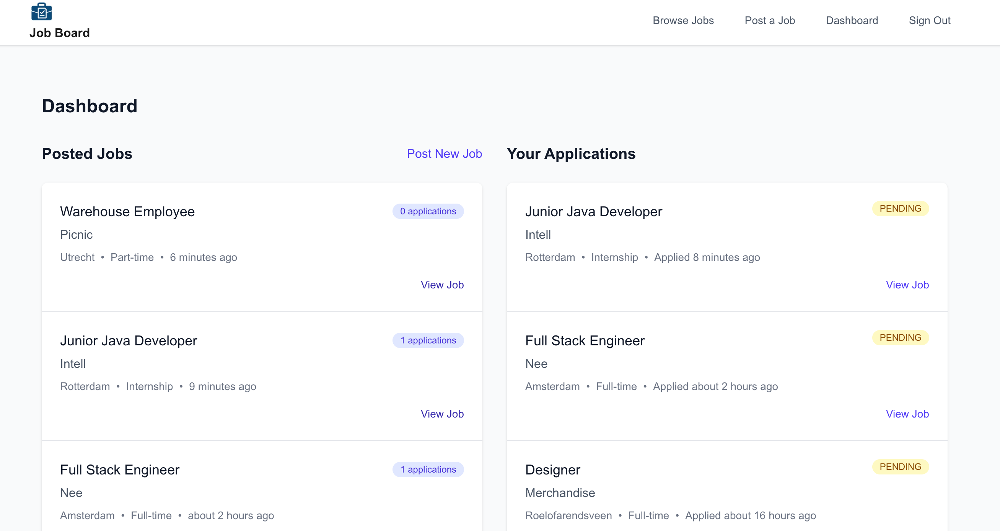

# Job Board

A full-stack job board for browsing, posting and applying to job opportunities.

[Live Demo](https://job-board-ruddy-delta.vercel.app/)

## Features

- URL-based job search, type, location and posting-date filters
- Paginated job listings with detailed job pages
- Job creation and anonymous application workflow
- Database-driven application tracking dashboard

## Tech Stack

Next.js · TypeScript · PostgreSQL · Prisma · Tailwind CSS

The demo uses seeded data and is intended for portfolio presentation.

## Screenshots

### Dashboard

